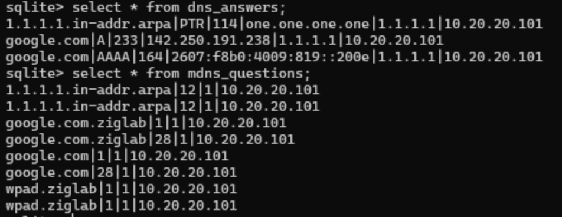

# teemo

> teemo is a stealthy, passive network reconnaissance tool that utilizes raw sockets to sniff network traffic for loot

## overview

teemo creates a raw socket and binds to an interface which is found using `GetAdaptersInfo`. once bound, layer 3 traffic is parsed for DNS and mDNS traffic which is stored in a sqlite database for further analysis. this assumes you already have administrative access on the target.

### supported protocols

- DNS (A, AAAA, PTR)
- mDNS

## usage

`cargo build --release --target x86_64-pc-windows-gnu`

`.\teemo.exe`

## notice

WORK IN PROGRESS !!
